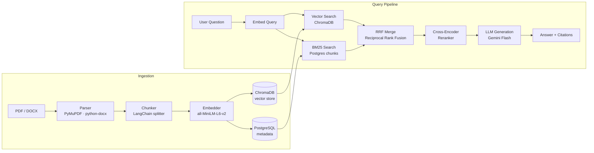

# Legal Doc RAG Assistant

A production-grade Retrieval-Augmented Generation (RAG) system for legal documents. Upload PDF or DOCX files, ask questions in natural language, and receive answers with inline source citations backed by verifiable chunk text. Built as a portfolio project to demonstrate end-to-end RAG system design — every stage of the pipeline (ingestion, retrieval, reranking, generation, evaluation) is implemented from scratch rather than delegated to an off-the-shelf framework.

## Architecture



## Tech Stack

| Component | Technology | Why |
|---|---|---|
| API framework | FastAPI (Python 3.11+) | Async-native, auto OpenAPI docs, production-ready |
| LLM | Google Gemini 2.5 Flash Lite | Free-tier access; strong instruction following for citation-grounded answers |
| Embeddings | sentence-transformers all-MiniLM-L6-v2 (384 dims) | Runs locally — no API cost or latency; well-supported in ChromaDB |
| Vector store | ChromaDB | Simple to self-host, async HTTP client, metadata filtering |
| Keyword search | rank-bm25 (BM25Okapi) | Complements vector search for exact term matching (defined terms, clause numbers) |
| Hybrid fusion | Reciprocal Rank Fusion (custom) | Parameter-free merging of ranked lists; robust across retrieval scenarios |
| Reranker | cross-encoder/ms-marco-MiniLM-L-6-v2 | Precision reranking with (query, chunk) joint scoring; no extra API call |
| Document parsing | PyMuPDF (PDF), python-docx (DOCX) | Reliable text extraction; fail-fast on scanned images |
| Chunking | LangChain RecursiveCharacterTextSplitter | Semantic boundary awareness, configurable overlap |
| Database | PostgreSQL 16 + SQLAlchemy async | Relational metadata, eval history, cascade deletes |
| Evaluation | RAGAS + custom heuristics | Industry-standard LLM-as-judge + lightweight retrieval metrics |
| Frontend | React + TypeScript (Vite + Tailwind) | Streaming UI, footnote citations, eval dashboard |
| Containerisation | Docker + Docker Compose | Single-command local setup; cloud-ready by design |

## Prerequisites

- Docker and Docker Compose
- A **Google Gemini API key** — get one free at [aistudio.google.com](https://aistudio.google.com)

## How to Run

```bash
git clone <repo-url>
cd legal-doc-rag-assistant

# 1. Create your .env file
cp .env.example .env

# 2. Open .env and set your Gemini API key:
#    GEMINI_API_KEY=your-key-here

# 3. Start all services (API, ChromaDB, PostgreSQL, frontend)
docker compose up --build
```

Open **http://localhost:5173** in your browser.

- Upload a PDF or DOCX via the sidebar drag-and-drop zone.
- Ask questions in the Chat tab — answers stream in real time with clickable footnote citations.
- Switch to the Evaluation tab to run RAGAS scoring against the bundled golden dataset.

> **Note:** The sentence-transformers embedding model (~90 MB) and cross-encoder reranker model (~22 MB) are downloaded from Hugging Face on first startup. Subsequent starts use a cached copy inside the container image.

## Evaluation

The system evaluates retrieval quality and generation quality separately, using two complementary metric families:

**Retrieval metrics (heuristic, fast):**
- **Context Precision** — fraction of retrieved chunks whose source file appears in the golden relevant-sources list.
- **Context Recall** — fraction of golden relevant source files covered by at least one retrieved chunk.

**Generation metrics (RAGAS, LLM-as-judge):**
- **Faithfulness** — does the answer make only claims that are grounded in the retrieved context?
- **Answer Relevancy** — does the answer actually address the question asked?

| Metric | Score |
|---|---|
| Context Precision | 100% |
| Context Recall | 100% |
| Faithfulness | N/A — see Known Limitations |
| Answer Relevancy | N/A — see Known Limitations |

Run evaluation via the **Evaluation** tab in the UI, or from the command line:

```bash
# Trigger via API
curl -X POST http://localhost:8080/api/eval/run
```

## Design Decisions

1. **Hybrid retrieval over pure vector search.** Vector search excels at semantic similarity but misses exact legal terms (defined terms, clause numbers, party names). BM25 catches exact-match queries that embeddings generalise over. RRF fuses both ranked lists without any per-domain tuning — the k=60 constant is robust across retrieval scenarios per the original paper.

2. **Cross-encoder reranking as a second stage.** Bi-encoder embeddings (used in vector search) trade precision for speed by computing query and document representations independently. A cross-encoder sees the (query, chunk) pair together, so it captures fine-grained relevance that the retrieval stage misses. Running it over the top-20 hybrid candidates is fast enough to fit within a single request.

3. **Local embeddings over an API service.** Using `all-MiniLM-L6-v2` via sentence-transformers means zero embedding cost and no outbound API latency during ingestion or retrieval. The trade-off is ~90 MB of model weight in the container image and slightly lower embedding quality vs. a large hosted model. For a legal domain portfolio system the quality is sufficient and the cost/latency wins are significant.

4. **Heuristic retrieval metrics + RAGAS generation metrics.** RAGAS requires an LLM call per question, which is slow and costs quota. Running it per-query in production would make every answer 2–3× more expensive. The heuristic precision/recall metrics are O(1) and give immediate feedback during development. RAGAS is reserved for batch evaluation runs where the cost is amortised across the whole test set.

5. **Rollback-on-failure ingestion.** If any stage of ingestion fails (parsing, embedding, ChromaDB write, Postgres write), the system rolls back all partial writes and marks the document as `failed` with the specific error reason. There is no partial-ingest state: a document is either fully ready or it never existed. This keeps retrieval clean — no half-ingested chunks produce spurious search results.

6. **No auth / single-user scope.** Authentication (JWT, sessions, per-user ChromaDB namespacing) is well-understood engineering but orthogonal to demonstrating RAG system design. The database schema uses a `user_id`-prefixable collection naming convention so per-user isolation can be wired in without restructuring the data model.

## Known Limitations

- **RAGAS generation metrics unavailable.** The RAGAS library's `faithfulness` and `answer_relevancy` metrics rely on asyncio internals that conflict with `uvloop` (used by the FastAPI container). Evaluation falls back to `None` for these metrics rather than aborting the run. Heuristic retrieval metrics (Context Precision / Context Recall) are unaffected.
- **Scanned PDFs not supported.** The parser detects image-only pages and rejects them with a clear error. Only text-based PDFs are processed.
- **Single-user, no authentication.** There is no login, session isolation, or per-user document namespace. All uploaded documents are visible to any client that can reach the API.

## What I'd Build Next

- **OCR support** for scanned PDFs via Tesseract or an OCR API, turning the current hard rejection into a slow-path processing option.
- **Multi-tenant collections** by wiring an identity layer into the ChromaDB collection naming — the schema already anticipates this.
- **Async ingestion queue** (Celery + Redis or ARQ) to handle large documents without blocking the HTTP response, with polling for status.
- **Prometheus metrics** on retrieval latency, reranker latency, and LLM token counts for production observability.
- **Fine-tuned embedding model** on a legal corpus to improve retrieval precision for domain-specific terminology.

## Screenshots

See `/docs/screenshots/` for UI screenshots.


