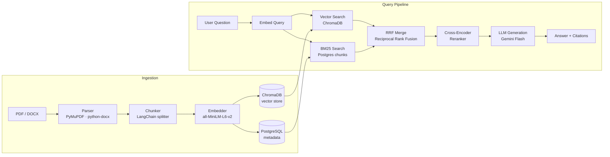

# Legal Doc RAG Assistant

A Retrieval-Augmented Generation system for legal documents. Upload PDF or DOCX files, ask questions in natural language, and receive answers with inline source citations backed by verifiable chunk text. Built as a portfolio project to demonstrate end-to-end RAG system design — every stage of the pipeline (ingestion, retrieval, reranking, generation, evaluation) is implemented from scratch rather than delegated to an off-the-shelf framework.

## Architecture



## Tech Stack

| Component | Technology | Why |
|---|---|---|
| API framework | FastAPI (Python 3.11+) | Async-native, auto OpenAPI docs, production-ready |
| LLM | Google Gemini 2.5 Flash Lite | Free-tier access; strong instruction following for citation-grounded answers |
| Embeddings | sentence-transformers all-MiniLM-L6-v2 (384 dims) | Runs locally — no API cost or latency; well-supported in ChromaDB |
| Vector store | ChromaDB | Simple to self-host, async HTTP client, metadata filtering |
| Keyword search | rank-bm25 (BM25Okapi) | Complements vector search for exact term matching (defined terms, clause numbers) |
| Hybrid fusion | Reciprocal Rank Fusion (custom) | Parameter-free merging of ranked lists; robust across retrieval scenarios |
| Reranker | cross-encoder/ms-marco-MiniLM-L-6-v2 | Precision reranking with (query, chunk) joint scoring; no extra API call |
| Document parsing | PyMuPDF (PDF), python-docx (DOCX) | Reliable text extraction; fail-fast on scanned images |
| Chunking | LangChain RecursiveCharacterTextSplitter | Semantic boundary awareness, configurable overlap |
| Database | PostgreSQL 16 + SQLAlchemy async | Relational metadata, eval history, cascade deletes |
| Evaluation | RAGAS + custom heuristics | Industry-standard LLM-as-judge + lightweight retrieval metrics |
| Frontend | React + TypeScript (Vite + Tailwind) | Streaming UI, footnote citations, eval dashboard |
| Containerisation | Docker + Docker Compose | Single-command local setup; cloud-ready by design |

## Prerequisites

- Docker and Docker Compose
- A **Google Gemini API key** — get one free at [aistudio.google.com](https://aistudio.google.com)

## How to Run

```bash
git clone <repo-url>
cd legal-doc-rag-assistant

# 1. Create your .env file
cp .env.example .env

# 2. Open .env and set your Gemini API key — it is the only required value:
#    GEMINI_API_KEY=your-key-here

# 3. Start all services (API, ChromaDB, PostgreSQL, frontend)
docker compose up --build
```

Open **http://localhost:5173** in your browser.

- Upload a PDF or DOCX via the sidebar drag-and-drop zone.
- Ask questions in the Chat tab — answers stream in real time with clickable footnote citations.
- Switch to the Evaluation tab to run RAGAS scoring against the bundled golden dataset.

> **Note:** The sentence-transformers embedding model (~90 MB) and cross-encoder reranker model (~22 MB) are downloaded from Hugging Face on first startup. Subsequent starts use a cached copy inside the container image.

## Evaluation

The system evaluates retrieval quality and generation quality separately, using two complementary metric families:

**Retrieval metrics (heuristic, fast):**
- **Context Precision** — fraction of retrieved chunks whose source file appears in the golden relevant-sources list.
- **Context Recall** — fraction of golden relevant source files covered by at least one retrieved chunk.

**Generation metrics (RAGAS, LLM-as-judge):**
- **Faithfulness** — does the answer make only claims grounded in the retrieved context?
- **Answer Relevancy** — does the answer actually address the question asked?

| Metric | Score |
|---|---|
| Context Precision | 100% |
| Context Recall | 100% |
| Faithfulness | N/A — see Known Limitations |
| Answer Relevancy | N/A — see Known Limitations |

Scores are against a single golden document (`carrier_agreement.docx`); 100% precision/recall is a correct result for that test set. See Known Limitations for why RAGAS generation metrics are unavailable.

Run evaluation via the **Evaluation** tab in the UI, or from the command line:

```bash
curl -X POST http://localhost:8080/api/eval/run
```

## Design Decisions

1. **Hybrid retrieval over pure vector search.** Vector search excels at semantic similarity but misses exact legal terms (defined terms, clause numbers, party names). BM25 catches exact-match queries that embeddings generalise over. RRF fuses both ranked lists without any per-domain tuning — the k=60 constant is robust across retrieval scenarios per the original paper.

2. **Cross-encoder reranking as a second stage.** Bi-encoder embeddings trade precision for speed by computing query and document representations independently. A cross-encoder sees the (query, chunk) pair together, capturing fine-grained relevance that the retrieval stage misses. Running it over the top-20 hybrid candidates fits within a single request.

3. **Local embeddings over an API service.** Using `all-MiniLM-L6-v2` via sentence-transformers means zero embedding cost and no outbound API latency during ingestion or retrieval. The trade-off is ~90 MB of model weight in the container image and slightly lower embedding quality vs. a large hosted model. For a legal-domain portfolio system the quality is sufficient and the cost/latency wins are significant.

4. **Heuristic retrieval metrics + RAGAS generation metrics.** RAGAS requires an LLM call per question, which is slow and costs quota. Running it per-query in production would make every answer 2–3× more expensive. Heuristic precision/recall metrics are O(1) and give immediate feedback during development. RAGAS is reserved for batch evaluation runs where the cost is amortised across the whole test set.

5. **Rollback-on-failure ingestion.** If any stage of ingestion fails (parsing, embedding, ChromaDB write, Postgres write), the system deletes any ChromaDB vectors already written, rolls back the Postgres session, and marks the document as `failed` with the specific error reason. There is no partial-ingest state: a document is either fully ready or it never existed.

6. **No auth / single-user scope.** Authentication (JWT, sessions, per-user ChromaDB namespacing) is well-understood engineering but orthogonal to demonstrating RAG system design. The database schema uses a `user_id`-prefixable collection naming convention so per-user isolation can be wired in without restructuring the data model.

## Post-audit engineering work

After the initial build I audited this codebase against production standards — the full report is in `docs/audit-report.md`. It identified five high-severity issues and nine medium/low items. Phase 1 addressed all five highs; Phase 2 cleared five medium items and dead code surfaced by a verification pass on Phase 1. Both phases are documented in `docs/`.

**Connection pooling.** The original code called `create_async_engine` inside each route's session generator, creating a new connection pool on every HTTP request. Under three concurrent uploads this would open ~45 Postgres connections. The engine now lives in the FastAPI `lifespan` handler, stored in `app.state`, with a single shared session factory derived from it.

**BM25 index caching.** The BM25 index was rebuilt on every query by loading all chunk rows from Postgres, tokenising them, and constructing `BM25Okapi`. At 50 documents (~1,500 chunks) this would dominate retrieval latency. The index is now cached in `app.state` with a `dirty` flag set on document add or delete, triggering a lazy rebuild on the next query only.

**Event loop blocking.** `SentenceTransformer.encode` (ingestion), `model.encode` (query embedding), and `CrossEncoder.predict` (reranking) were synchronous CPU-bound calls running directly inside async handlers, blocking the event loop for 200 ms–15 s per call. All three are now wrapped with `asyncio.to_thread`, matching the pattern already used in the evaluation pipeline.

**Cross-store consistency.** Two data integrity gaps: if a Postgres commit failed after ChromaDB vectors were written, the orphaned vectors would appear in future search results — the ingestion rollback now explicitly deletes the written vectors by ID. Separately, a DELETE request that failed to remove ChromaDB vectors was silently returning 204 and deleting the Postgres row anyway, leaving permanently orphaned vectors — the endpoint now returns 503 and leaves Postgres untouched if ChromaDB is unavailable.

## Known limitations and next steps

**RAGAS faithfulness and answer-relevancy scores are unavailable.** The RAGAS library uses asyncio internals that conflict with `uvloop` (used in the FastAPI container). Evaluation falls back to `None` for these two metrics; heuristic retrieval metrics are unaffected. Fix: run RAGAS in a subprocess or in a separate evaluation service outside the uvloop environment.

**No async ingestion queue.** Ingestion runs synchronously in the HTTP handler. A 50 MB file-size cap and a 200-page limit constrain the blast radius, but there is no background worker, no polling endpoint, and no partial-status reporting. Fix: ARQ or Celery with Redis; the document `status` column and `error_message` field already support a polling model.

**No OCR for scanned PDFs.** The parser detects image-only pages and rejects them with a clear error. Only text-based PDFs are processed. Fix: Tesseract via `pytesseract` or a managed OCR API as a pre-processing step before the existing parser.

**Single-user, no authentication.** All uploaded documents are visible to any client that reaches the API. There is no login, session isolation, or per-user ChromaDB namespace. Fix: JWT middleware plus a `user_id` prefix on ChromaDB collection names — the naming convention anticipates this without a schema change.

**No Alembic migrations.** `Base.metadata.create_all` runs on startup. This is safe for a local Docker Compose target but incompatible with a shared database or zero-downtime deploys. Fix: generate an initial Alembic migration from the current models and wire it into the deploy step.

**BM25 tokeniser strips legal-citation punctuation.** The tokeniser removes all punctuation including `§`, `.`, and `/`. Queries for `§12.3(a)` or `U.S.C. §101` lose their structural meaning, partially defeating BM25's advantage over vector search for exact clause lookup. Fix: replace `string.punctuation` with a custom set that preserves `§`, `.`, `/`.

**ChromaDB Docker healthcheck uses `service_started`, not `service_healthy`.** ChromaDB takes a few seconds to be ready after its container starts. On a cold start the API may fail its first ChromaDB request. Fix: add a ChromaDB healthcheck (`curl -f http://localhost:8000/api/v1/heartbeat`) and change the `condition` in `docker-compose.yml` to `service_healthy`.

**Streaming errors are not forwarded to the client.** If Gemini fails mid-stream, the `async for` in the event generator ends abruptly with no error payload. The client sees a truncated response. Fix: wrap the generator loop in try/except and emit a final `{"error": "..."}` event before closing.

**No request correlation IDs.** Log lines from `hybrid_search`, `rerank`, and `generate_answer` for the same request share no common identifier. Under concurrent load it is not possible to trace a full pipeline execution from a log file alone. Fix: generate a `query_id = uuid4()` at the route handler and thread it through all downstream log calls.

**Per-query RAGAS scoring deferred.** RAGAS requires an LLM call per question — running it inline would make every answer 2–3× more expensive. Evaluation is batch-only, run on demand against the golden dataset. Fix: a background queue that scores answers asynchronously after they are returned to the user.

## Screenshots

See `/docs/screenshots/` for UI screenshots.


